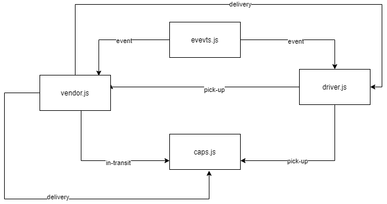

# caps


## About 
Authroiztion limits for user, writer, editor and admin, each account has a different authoroties and the higher one it the admin 

<hr>

## Author
Emran Aloul
<hr>

## Links

* [Pull Request](https://github.com/emranaloul/caps/pull/1)
* [Actions](https://github.com/emranaloul/caps/actions)
* [Repo](https://github.com/emranaloul/caps)

<hr>

## Setup
1. `(.env)` file 

```
STORE=CAPS

```
2. Install the following dependencies

```
npm init -y 
npm i  dotenv  
npm i -D jest supertest


```
## Running the app 
1. clone the repo.
2. Enter the command `npm start`
3. Use endpoints :
  

4. Test . 
* There's 1 test files .logger.test.js
* In terminal run :

```
npm test
```


## UML Diagram

